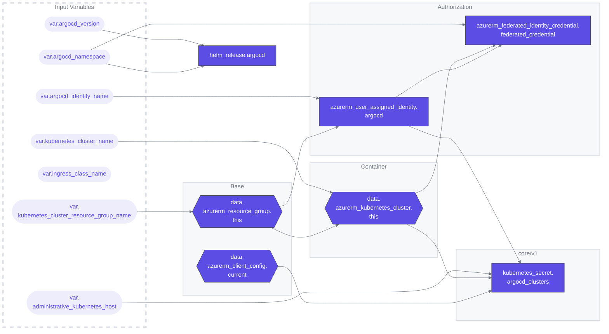

# Azure Administrative ArgoCD

## Overview
This Terraform configuration is designed to automate the deployment and configuration of Argo CD on Azure Kubernetes Service (AKS). It simplifies the process of setting up Argo CD with the necessary Azure integrations.

### Terraform Architecture

## Features
- **Kubernetes Cluster Data Retrieval**: Fetches data about an existing AKS cluster.
- **User-Assigned Identity Creation**: Sets up a user-assigned identity for Argo CD.
- **Federated Identity Credential Management**: Manages federated identity credentials for seamless integration with Azure.
- **Helm Chart Deployment**: Deploys Argo CD using a Helm chart, with options for ingress and server configurations.
- **Secret Management for Kubernetes Clusters**: Creates a Kubernetes secret for Argo CD cluster configurations.

## File Structure
- [01-providers.tf](./01-providers.tf): Specifies the required providers such as AzureRM, Helm, and Kubernetes.
- [outputs.tf](./outputs.tf): This file is intended for defining module outputs. (Note: Currently, this file does not contain any outputs as per the provided code.)
- [variables.tf](./variables.tf): Defines variables required for the configuration, like Kubernetes cluster details and Argo CD settings.

## Example
For usage examples, please refer to the [`example`](./example) directory. This directory will provide practical examples of how to use this Terraform module in your projects.

## Workflows
| Name | Description |
|---|---|
| [terraform-ci.yaml](.github/workflows/terraform-ci.yaml) | A workflow for linting and auto-formatting Terraform code. Triggered by pushes to  `main` and `dev` branches or on pull requests, it consists of two jobs: `tflint` for lint checks, `format` for code formatting and submit a PR, and `tfmermaid` to update architecture graph and submit a PR. |
